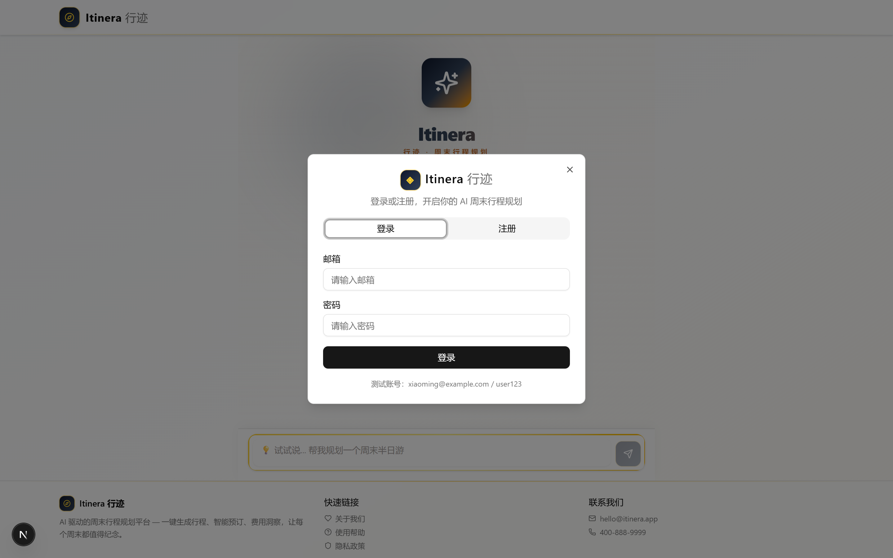
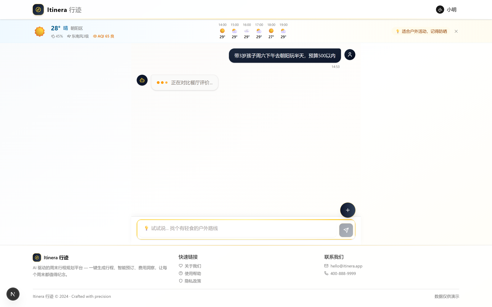
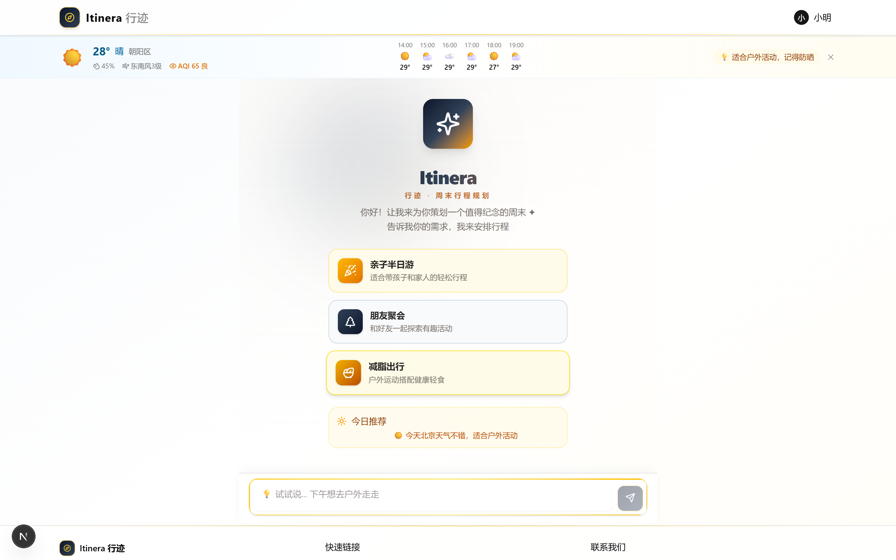
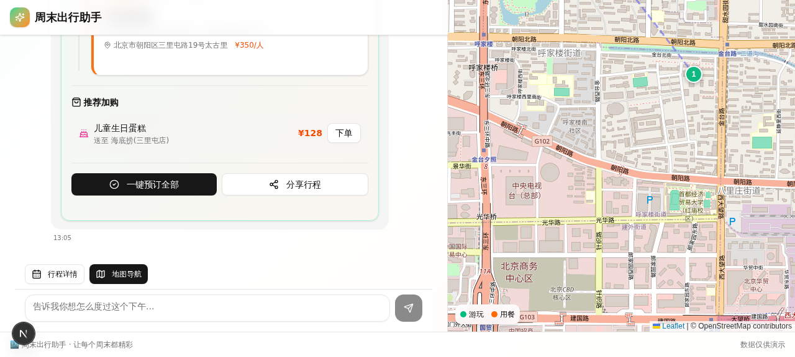

# Itinera 行迹

[简体中文](./README.md) | [English](./README.en.md)

一个基于 Next.js、Prisma、SQLite 和 OpenAI 兼容大模型接口构建的 AI 周末行程规划应用。

Itinera（行迹）可以把自然语言出行需求转换成结构化周末行程。用户可以输入“周六下午带 5 岁孩子在朝阳玩半天，预算 500 以内”之类的描述，应用会结合本地场馆数据、餐厅数据、天气式上下文、预算估算、地图和预订式流程，生成一份可以查看、调整和继续操作的行程方案。

这个仓库适合作为 AI consumer app、本地数据驱动的规划流程、LLM + 数据库应用，以及 Next.js 全栈产品原型的开源参考。

<p align="center">
  
</p>

## 为什么做这个项目

大多数 AI demo 停留在“生成一段文本”。Itinera 试图展示一个更接近真实产品的模式：

- 用户用自然语言表达意图。
- 服务端从本地数据库检索候选场馆和餐厅。
- 大模型基于候选数据生成结构化 itinerary JSON。
- 服务端解析、校验并在必要时降级到确定性兜底行程。
- 前端把结果呈现成时间线、地图、费用拆解、详情弹窗和预订式操作。

它不是一个简单聊天框，而是一个围绕“周末怎么安排”做完整体验闭环的 AI 应用原型。

## 项目亮点

- **结构化 AI 输出**：模型输出必须包含 itinerary JSON，服务端会解析并校验关键字段。
- **产品闭环完整**：聊天规划、行程时间线、地图视图、场馆详情、预订、订单和个人中心在同一应用内串联。
- **模型供应商可替换**：支持 OpenAI、DeepSeek、智谱 GLM、Moonshot、Ollama 等兼容 `/chat/completions` 的接口。
- **城市数据可迁移**：当前 seed 数据以北京为例，替换 `prisma/seed.ts` 即可改造成其他城市版本。
- **本地启动轻量**：SQLite + Prisma，无需额外数据库服务，适合快速演示和二次开发。
- **开源基础完整**：包含 MIT License、CI、Dockerfile、API 文档、贡献指南、安全策略和单元测试。

## 功能预览

| 对话生成行程 | 结构化行程时间线 |
| --- | --- |
|  |  |

| 登录后的个人体验 | 地图视图 |
| --- | --- |
|  |  |

## 核心功能

- **AI 行程规划**：根据时间、区域、预算、同行人群和偏好生成活动 + 用餐安排。
- **行程时间线**：展示每个步骤的开始时间、结束时间、地点、费用、说明和操作入口。
- **费用拆解**：展示活动、餐饮、配送式订单等费用构成和人均成本。
- **交互式地图**：基于 Leaflet、React Leaflet 和 OpenStreetMap 展示地点位置。
- **天气式提示**：提供演示用的分区天气、AQI、逐小时预报和出行建议。
- **场馆详情**：展示评分、开放时间、设施、评价、拥挤度和餐厅菜单等信息。
- **预订与订单模拟**：支持创建预订记录和配送式订单记录，用于展示完整产品流程。
- **账号与个人中心**：包含本地演示账号、历史行程、预订记录和消费统计。
- **基础安全机制**：密码使用 Node.js `crypto.scrypt` 加盐哈希；关键接口带内存限流。

## 技术栈

| 模块 | 技术 |
| --- | --- |
| 前端 | Next.js 15 App Router, React 19, TypeScript |
| UI | Tailwind CSS 4, shadcn/ui, Radix UI, Framer Motion |
| 数据库 | SQLite, Prisma ORM |
| AI 接入 | OpenAI-compatible Chat Completions API |
| 地图 | Leaflet, React Leaflet, OpenStreetMap |
| 图表 | Recharts |
| 校验与安全 | Zod, scrypt password hashing, in-memory rate limiting |
| 测试 | Vitest |
| 部署 | Docker, Docker Compose, GitHub Actions |

## 快速开始

### 环境要求

- Node.js 18.18 或更高版本
- npm
- 一个 OpenAI 兼容模型服务的 API Key

### macOS / Linux

```bash
git clone https://github.com/GOOD-123-CPU/itinera.git
cd itinera

cp .env.example .env
npm run setup
npm run dev
```

### Windows PowerShell

```powershell
git clone https://github.com/GOOD-123-CPU/itinera.git
cd itinera

Copy-Item .env.example .env
npm.cmd run setup
npm.cmd run dev
```

启动后访问：

```text
http://localhost:3000
```

`npm run setup` 会安装依赖、同步 Prisma schema 到 SQLite，并写入演示数据。

## 环境变量

复制 `.env.example` 后，至少需要配置：

```env
DATABASE_URL="file:../db/custom.db"
LLM_BASE_URL="https://api.openai.com/v1"
LLM_API_KEY="sk-your-api-key-here"
LLM_MODEL="gpt-4o-mini"
```

兼容服务示例：

| 服务商 | `LLM_BASE_URL` | `LLM_MODEL` 示例 |
| --- | --- | --- |
| OpenAI | `https://api.openai.com/v1` | `gpt-4o-mini` |
| DeepSeek | `https://api.deepseek.com/v1` | `deepseek-chat` |
| 智谱 GLM | `https://open.bigmodel.cn/api/paas/v4` | `glm-4-flash` |
| Moonshot | `https://api.moonshot.cn/v1` | `moonshot-v1-8k` |
| Ollama 本地模型 | `http://localhost:11434/v1` | `qwen2.5:7b` |

## Docker 运行

在项目根目录创建 `.env`，填入 `LLM_API_KEY`，然后运行：

```bash
docker compose up -d --build
curl http://localhost:3000/api/health
```

Docker 版本使用多阶段构建，容器内以非 root 用户运行，SQLite 数据通过 named volume 持久化。

## 常用脚本

```bash
npm run dev            # 启动开发服务器
npm run build          # 生产构建
npm run start          # 启动生产服务器
npm run lint           # ESLint 检查
npm test               # 运行单元测试
npm run test:coverage  # 生成测试覆盖率
npm run db:push        # 同步 Prisma schema 到 SQLite
npm run db:seed        # 写入演示数据
```

测试覆盖范围包括：

- LLM 行程解析与字段校验
- 确定性兜底行程生成
- 密码哈希与密码校验
- 接口速率限制
- LLM 客户端错误处理与重试

## 演示账号

| 角色 | 邮箱 | 密码 |
| --- | --- | --- |
| 管理员 | `admin@planner.com` | `admin123` |
| 用户 | `xiaoming@example.com` | `user123` |

这些账号只用于本地演示。生产环境请替换认证方案、禁用默认账号、启用 HTTPS，并接入真实用户体系。

## API

REST API 默认挂载在：

```text
http://localhost:3000/api
```

主要接口：

- `GET /api/health`
- `POST /api/auth`
- `GET /api/venues`
- `GET /api/restaurants`
- `POST /api/agent`
- `POST /api/reservations`
- `POST /api/orders`
- `GET /api/weather`
- `GET /api/venue-detail`

完整请求体、响应结构、校验规则、限流策略和错误格式见 [API.md](./API.md)。

## 项目结构

```text
.
├── .github/              # CI、Issue 模板、PR 模板
├── db/                   # SQLite 数据目录，真实数据库文件不提交
├── docs/screenshots/     # README 与 QA 截图
├── prisma/
│   ├── schema.prisma     # Prisma 数据模型
│   └── seed.ts           # 北京演示数据
├── public/               # 静态资源
├── src/
│   ├── app/              # Next.js 页面与 API routes
│   ├── components/       # 业务组件与 UI 组件
│   ├── hooks/            # React hooks
│   └── lib/              # 数据库、LLM、密码、限流与行程逻辑
├── tests/                # Vitest 单元测试
├── API.md
├── Dockerfile
├── docker-compose.yml
└── package.json
```

## 自定义城市数据

城市数据主要位于 `prisma/seed.ts`。你可以替换：

- 行政区或商圈
- 场馆名称、类型、坐标、价格、开放时间、适合人群
- 餐厅名称、菜系、坐标、人均消费、菜单
- 天气、拥挤度、评价等演示字段

修改后重新执行：

```bash
npm run db:seed
```

## 开源前安全说明

项目默认忽略以下本地文件：

- `.env`, `.env.local`, `.env*.local`
- `db/*.db`, `db/*.db-journal`
- `node_modules/`
- `.next/`, `.next-build/`, `.next-dev/`
- 日志、覆盖率、编辑器缓存

提交代码前建议执行：

```bash
git status --short
git diff --cached
```

确认没有真实 API Key、数据库文件、私人截图或生产配置被提交。

## 生产化建议

Itinera 当前定位是可运行的产品原型和开源参考。如果要服务真实用户，建议补齐：

- OAuth、邮箱验证或更完整的账号体系
- Redis 或数据库级限流
- 真实天气、路线规划、支付、短信和邮件服务
- 结构化日志、监控和错误追踪
- 管理后台和内容审核流程
- 数据库迁移、备份和运维手册

## 贡献

欢迎提交 Issue 和 Pull Request。开始前建议阅读：

- [CONTRIBUTING.md](./CONTRIBUTING.md)
- [CODE_OF_CONDUCT.md](./CODE_OF_CONDUCT.md)
- [SECURITY.md](./SECURITY.md)

## 免责声明

- 天气、消息、预订和配送订单包含演示或模拟逻辑。
- seed 数据中的场馆和餐厅信息仅用于产品演示，实际出行请以商家公开信息为准。
- 使用任何 LLM 服务时，请遵守对应服务商条款，并按所在地法律法规处理用户数据。

## 许可证

[MIT](./LICENSE) © 2026 Itinera contributors
